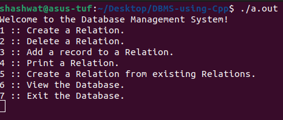

# 🌟 RDBMS Project

Welcome to the RDBMS Project! This project implements a Relational Database Management System (RDBMS) using C++. Dive into the world of databases and witness the power of custom data structures and efficient SQL functionalities.

## 📁 Project Structure

```
├── a.out
├── fort.c
├── fort.h
├── fort.hpp
├── rdb-attr.cpp
├── rdb-basics.cpp
├── rdb.h
├── rdb-join.cpp
└── rdb-main.cpp
```

## 🚀 Features

- **Custom Attributes**: Different attribute types (`integer`, `string`, `float`, `double`) with operator overloading.
- **Record Management**: Create, copy, and print records with ease.
- **Relations**: Handle multiple records, attribute types, and perform operations like union, difference, cartesian product, projection, selection, and renaming.
- **Natural Join**: Perform natural joins between relations.
- **DNF Formula**: Support for Disjunctive Normal Form (DNF) formulas for complex selections.

## 🛠️ Classes and Structures

### Attr (Base Class for Attributes)
- Overloaded operators for comparison.
- Pure virtual function `copy_attr` for creating copies of attributes.

### Record
- Manages a collection of attributes.
- Supports copying and printing of records.

### Relation
- Manages multiple records.
- Supports various operations like union, difference, cartesian product, projection, selection, and renaming.

### Basics
- Contains utility functions for validating and performing operations on relations.

### IntegerAttribute, StringAttribute, FloatAttribute, DoubleAttribute
- Derived classes from `Attr` for handling specific types of attributes.
- Implement comparison operators and `copy_attr`.

### DNFformula
- Structure for handling complex selection conditions in DNF.

## 🔧 Usage

1. **Compile the project**:
   ```sh
   g++ -o rdbms rdb-*.cpp fort.cpp
   ```

2. **Run the executable**:
   ```sh
   ./rdbms
   ```

3. **Explore the functionality**:
   - Create relations
   - Add records
   - Perform operations like union, difference, cartesian product, projection, selection, renaming, and natural join.

## 📸 Screenshots



## 📜 License

This project is licensed under the MIT License.

## 🙏 Acknowledgements

Special thanks to everyone who supported the development of this project. Your feedback and encouragement were invaluable.

---

Dive into the code and start exploring the capabilities of this RDBMS. Happy coding! 💻🚀